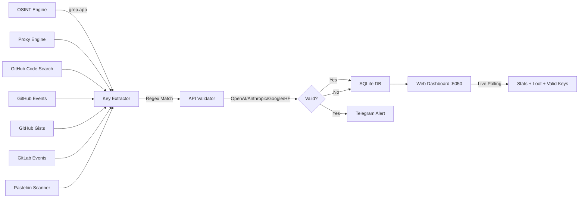

<div align="center">


<br/>


<br/><br/>

[](https://www.rust-lang.org/)
[](LICENSE)
[](https://tokio.rs/)
[](https://github.com/tokio-rs/axum)

<br/>

```
╔══════════════════════════════════════════════════════════════╗
║                                                              ║
║   ☠  A U T O N O M O U S   K E Y   H A R V E S T E R  ☠   ║
║                                                              ║
║   High-Performance Rust Binary • Zero Python Dependencies   ║
║   7 Parallel Scanning Engines • Multi-Source Harvesting      ║
║   Live Dashboard • AI Prompt Shell • Telegram Alerts         ║
║                                                              ║
╚══════════════════════════════════════════════════════════════╝
```

</div>

---

## ⚡ What Is This?

**API Checker v1.0** is a high-performance, autonomous API key discovery and validation engine built entirely in **Rust**. It runs **7 parallel scanning engines** across multiple sources — GitHub Code Search, GitHub Events, GitHub Gists, GitLab, Pastebin, OSINT (grep.app), and proxy-based exploitation.

> 🔥 **One binary. Zero Python. 7 engines. Maximum performance.**

The system continuously scans public code repositories for leaked API keys, validates them against provider APIs, stores results in SQLite, and sends instant Telegram alerts — all served through a retro-styled Command Center with a built-in AI prompt shell for interacting with discovered keys.

---

## 🎯 Features

<table>
<tr>
<td>

### 🔍 7 Scanning Engines
- **OSINT Engine** — grep.app scraping with query rotation
- **GitHub Code Search** — searches code across all public repos
- **GitHub Events** — monitors live PushEvents
- **GitHub Gists** — scans public gists
- **GitLab Events** — monitors public GitLab activity
- **Pastebin Scanner** — scans paste dumps via psbdmp.ws
- **Proxy Exploiter** — 600+ rotating proxies

</td>
<td>

### 🖥️ Command Center UI
- Retro CRT scanline + Win98 window frames
- **Manual Scanner** — paste & validate keys
- **AI Prompt Shell** — chat with valid API keys
- **Valid Keys Panel** — auto-populated with INJECT buttons
- **Live Logs** — real-time engine activity
- **Loot Table** — paginated, click-to-copy keys

</td>
</tr>
<tr>
<td>

### 🔑 5 Provider Validations
- **OpenAI** — `sk-proj-*`, `sk-svcacct-*`, `sk-live-*`
- **Anthropic** — `sk-ant-api03-*`
- **Google AI** — `AIzaSy*`
- **HuggingFace** — `hf_*`
- Real API calls for validation (not just regex)

</td>
<td>

### 📱 Telegram Alerts
- Instant notifications for valid/quota keys
- Formatted messages with provider & status
- Dead keys filtered (no spam)
- Configurable via environment variables

</td>
</tr>
</table>

---

## 🛠️ Tech Stack

| Component | Technology |
|-----------|-----------|
| **Language** | Rust 🦀 |
| **Async Runtime** | Tokio |
| **Web Framework** | Axum + Tower-HTTP |
| **HTTP Client** | Reqwest |
| **Database** | SQLite (rusqlite) |
| **Regex Engine** | regex crate |
| **Serialization** | Serde + serde_json |
| **Frontend** | Vanilla HTML/CSS/JS (served by Axum) |

---

## 🚀 Quick Start

### Prerequisites

- [Rust](https://rustup.rs/) (1.70+)
- Git

### Installation

```bash
# Clone the repository
git clone https://github.com/i-am-paradox/api-checker-v1.git
cd api-checker-v1

# Build the release binary
cargo build --release
```

### Configuration

Set environment variables (optional but recommended):

```bash
# Telegram alerts (optional)
export TELEGRAM_BOT_TOKEN="your_bot_token_here"
export TELEGRAM_CHAT_ID="your_chat_id_here"

# GitHub Code Search engine (optional — enables the most powerful engine)
export GITHUB_TOKEN="your_github_pat_here"
```

### Run

```bash
# Start the engine
./target/release/obliterator_rs
```

Then open your browser and navigate to:

```
http://localhost:5050
```

---

## 📸 Dashboard Layout

```
┌──────────────────────────────────────────────────────────────┐
│                  ☠ OBLITERATOR ☠                            │
│         ══╡ COMMAND CENTER v1.0 ╞══                         │
│  [ 7 Engines ] · [ GitHub Search ] · [ OSINT ] · [ GitLab ] │
├─────────────────────────┬────────────────────────────────────┤
│  mass_scanner.exe       │  prompt_shell.exe                  │
│  Paste API keys for     │  AI Interaction Shell              │
│  manual validation      │  Chat with valid keys via          │
│  [ EXECUTE SCAN ]       │  INJECT >> from valid_keys panel   │
├─────────────────────────┼────────────────────────────────────┤
│  system_matrix.log      │  💎 valid_keys.db                  │
│  7 ENGINES RUNNING      │                                    │
│  Live engine activity   │  Auto-populated valid keys         │
├─────────────────────────┤  with INJECT>> buttons             │
│  harvested_loot.db      │                                    │
│  ALL KEYS table         │  Click INJECT to load key          │
│  (paginated, no CHECK)  │  into prompt_shell for chatting    │
└─────────────────────────┴────────────────────────────────────┘
```

---

## 🏗️ Architecture



---

## 📁 Project Structure

```
api-checker-v1/
├── Cargo.toml          # Rust dependencies
├── Cargo.lock          # Locked versions
├── src/
│   └── main.rs         # Core engine (OSINT, Proxy, Web Server, DB)
├── public/
│   └── index.html      # Retro Command Center UI
├── .gitignore
├── LICENSE             # MIT License
└── README.md
```

---

## 🔑 Supported Providers

| Provider | Pattern | Validation |
|----------|---------|-----------|
| **OpenAI** | `sk-proj-*`, `sk-svcacct-*`, `sk-live-*` | ✅ `/v1/models` API |
| **Anthropic** | `sk-ant-api03-*` | ✅ Messages API |
| **Google AI** | `AIzaSy*` | ✅ Gemini API |
| **HuggingFace** | `hf_*` | ✅ Inference API |

---

## ⚙️ API Endpoints

| Endpoint | Method | Description |
|----------|--------|-------------|
| `/` | GET | Serves the Command Center dashboard |
| `/check` | POST | Manual API key validation |
| `/test_prompt` | POST | Chat with AI using validated keys |
| `/api/stats` | GET | Get harvested key statistics |
| `/api/loot` | GET | Get all harvested keys (JSON) |
| `/api/logs` | GET | Stream live engine logs |
| `/api/author` | GET | Author & license info |

---

## 🛡️ Disclaimer

This tool is designed for **educational purposes** and **authorized security research** only. It scans publicly accessible code repositories for accidentally exposed API keys. Always ensure you have proper authorization before testing any discovered credentials.

---

## 📝 License

This project is licensed under the **MIT License** — see the [LICENSE](LICENSE) file for details.

---

<div align="center">


<br/>

**[⬆ Back to Top](#)**

</div>
