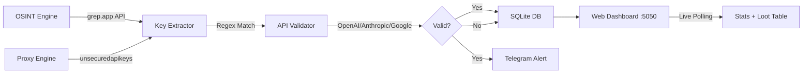

<div align="center">


<br/>


<br/><br/>

[](https://www.rust-lang.org/)
[](LICENSE)
[](https://tokio.rs/)
[](https://github.com/tokio-rs/axum)

<br/>

```
╔══════════════════════════════════════════════════════════════╗
║                                                              ║
║   ☠  A U T O N O M O U S   K E Y   H A R V E S T E R  ☠   ║
║                                                              ║
║   High-Performance Rust Binary • Zero Dependencies on Py     ║
║   OSINT Scraping • Proxy Rotation • API Validation           ║
║   Live Web Dashboard • Telegram Notifications                ║
║                                                              ║
╚══════════════════════════════════════════════════════════════╝
```

</div>

---

## ⚡ What Is This?

**API Checker v1.0** is a high-performance, autonomous API key discovery and validation engine built entirely in **Rust**. It combines OSINT scraping, proxy-based rate-limit exploitation, and real-time API validation into a single native binary.

> 🔥 **One binary. Zero Python. Maximum performance.**

The system continuously scans public code repositories for leaked API keys, validates them against provider APIs, stores results in a local SQLite database, and sends instant Telegram alerts when valid keys are found — all while serving a retro-styled live dashboard.

---

## 🎯 Features

<table>
<tr>
<td>

### 🔍 OSINT Engine
- Scans `grep.app` for leaked API keys
- 7 search query patterns with page rotation
- HTML tag stripping for clean extraction
- Regex-based key detection (OpenAI, Anthropic, Google AI, HuggingFace)

</td>
<td>

### 🌐 Proxy Exploiter
- Auto-fetches 600+ free HTTP proxies
- Rotating proxy pool for rate-limit bypass
- Stats tracking (success/fail counters)
- Automatic proxy refresh on exhaustion

</td>
</tr>
<tr>
<td>

### 🖥️ Live Dashboard
- Retro 90s hacker-style web UI
- CRT scanlines + Windows 98 window frames
- Real-time log streaming
- Paginated loot table with per-key CHECK buttons
- Click-to-copy API keys

</td>
<td>

### 📱 Telegram Alerts
- Instant notifications for valid/quota keys
- Formatted messages with provider & status
- Dead keys filtered (no spam)
- Configurable via environment variables

</td>
</tr>
</table>

---

## 🛠️ Tech Stack

| Component | Technology |
|-----------|-----------|
| **Language** | Rust 🦀 |
| **Async Runtime** | Tokio |
| **Web Framework** | Axum + Tower-HTTP |
| **HTTP Client** | Reqwest |
| **Database** | SQLite (rusqlite) |
| **Regex Engine** | regex crate |
| **Serialization** | Serde + serde_json |
| **Frontend** | Vanilla HTML/CSS/JS (served by Axum) |

---

## 🚀 Quick Start

### Prerequisites

- [Rust](https://rustup.rs/) (1.70+)
- Git

### Installation

```bash
# Clone the repository
git clone https://github.com/i-am-paradox/api-checker-v1.git
cd api-checker-v1

# Build the release binary
cargo build --release
```

### Configuration

Set up Telegram notifications (optional):

```bash
export TELEGRAM_BOT_TOKEN="your_bot_token_here"
export TELEGRAM_CHAT_ID="your_chat_id_here"
```

### Run

```bash
# Start the engine
./target/release/obliterator_rs
```

Then open your browser and navigate to:

```
http://localhost:5050
```

---

## 📸 Dashboard Preview

```
╔══════════════════════════════════════════════════════════════╗
║  ☠ OBLITERATOR ☠                                            ║
║  ══╡ COMMAND CENTER v1.0 ╞══                                ║
╠══════════════════════════════════════════════════════════════╣
║                                                              ║
║  ┌─────────────┐ ┌─────────────┐ ┌─────────────┐            ║
║  │ KEYS: 82    │ │ LIVING: 0   │ │ ► ACTIVE    │            ║
║  └─────────────┘ └─────────────┘ └─────────────┘            ║
║                                                              ║
║  ┌──────────────────────────────────────────────────────┐    ║
║  │ [mass_scanner.exe]                        [_ □ ×]    │    ║
║  │ C:\> Paste API keys for validation...                │    ║
║  │ > sk-proj-xxx...                                     │    ║
║  │ > AIzaSy...                                          │    ║
║  │                              [ EXECUTE SCAN ]        │    ║
║  └──────────────────────────────────────────────────────┘    ║
║                                                              ║
║  ┌──────────────────────────────────────────────────────┐    ║
║  │ [system_matrix.log]                       [_ □ ×]    │    ║
║  │ [*] OSINT SWEEP #42: Querying 'sk-proj-' (page 3)   │    ║
║  │ [!] OSINT MATCH: OpenAI key found => sk-proj-Xx...   │    ║
║  │ [~] RUST ENGINE CAUGHT: OpenAI | DEAD | Invalid      │    ║
║  └──────────────────────────────────────────────────────┘    ║
║                                                              ║
╚══════════════════════════════════════════════════════════════╝
```

---

## 🏗️ Architecture



---

## 📁 Project Structure

```
api-checker-v1/
├── Cargo.toml          # Rust dependencies
├── Cargo.lock          # Locked versions
├── src/
│   └── main.rs         # Core engine (OSINT, Proxy, Web Server, DB)
├── public/
│   └── index.html      # Retro Command Center UI
├── .gitignore
├── LICENSE             # MIT License
└── README.md
```

---

## 🔑 Supported Providers

| Provider | Pattern | Validation |
|----------|---------|-----------|
| **OpenAI** | `sk-proj-*`, `sk-live-*` | ✅ `/v1/models` API |
| **Anthropic** | `sk-ant-api03-*` | ✅ Messages API |
| **Google AI** | `AIzaSy*` | ✅ Gemini API |
| **HuggingFace** | `hf_*` | ✅ Inference API |

---

## ⚙️ API Endpoints

| Endpoint | Method | Description |
|----------|--------|-------------|
| `/` | GET | Serves the Command Center dashboard |
| `/check` | POST | Manual API key validation |
| `/test_prompt` | POST | Send prompts via validated keys |
| `/api/stats` | GET | Get harvested key statistics |
| `/api/loot` | GET | Get all harvested keys |
| `/api/logs` | GET | Stream live engine logs |

---

## 🛡️ Disclaimer

This tool is designed for **educational purposes** and **authorized security research** only. It scans publicly accessible code repositories for accidentally exposed API keys. Always ensure you have proper authorization before testing any discovered credentials.

---

## 📝 License

This project is licensed under the **MIT License** — see the [LICENSE](LICENSE) file for details.

---

<div align="center">


<br/>

**[⬆ Back to Top](#)**

</div>
